# licenta2025
Cross-platform mobile app (iOS &amp; Android) built with React Native, Firebase and Fitbit API integration. The app monitors users’ general health through real-time tracking of heart rate, sleep, calories, hydration and daily activity, providing personalized insights and recommendations.

## Preview

<table>
  <tr>
    <td align="center"><b>Welcome</b></td>
    <td align="center"><b>Fitbit Integration</b></td>
    <td align="center"><b>Home</b></td>
  </tr>
  <tr>
    <td>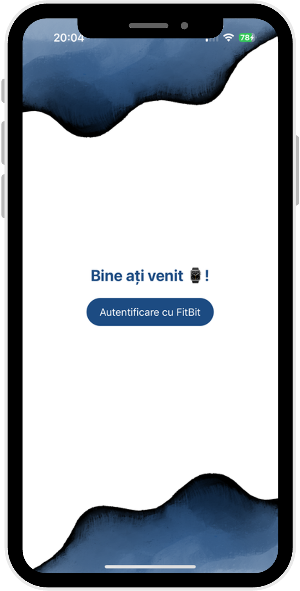</td>
    <td>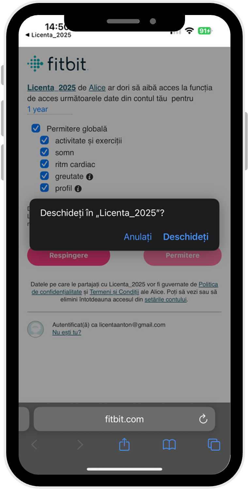</td>
    <td>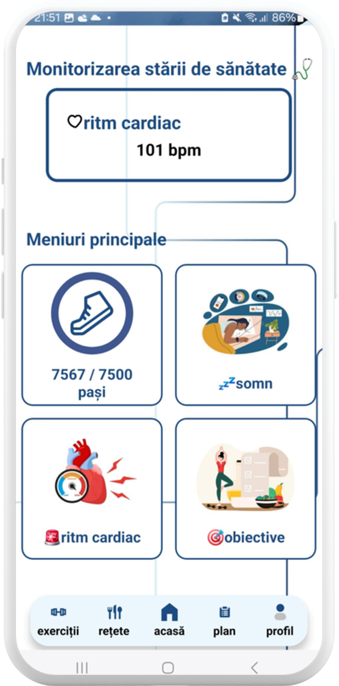</td>
  </tr>
</table>

 

<table>
  <tr>
    <td align="center"><b>Sleep Monitor</b></td>
    <td align="center"><b>Sleep Quality Model</b></td>
    <td align="center"><b>BPM Tracker</b></td>
  </tr>
  <tr>
    <td>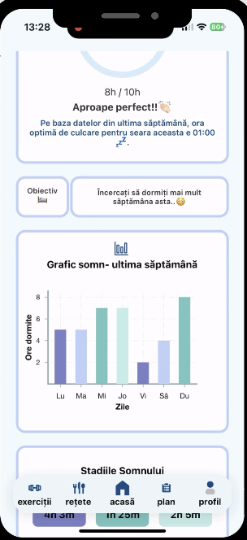</td>
    <td>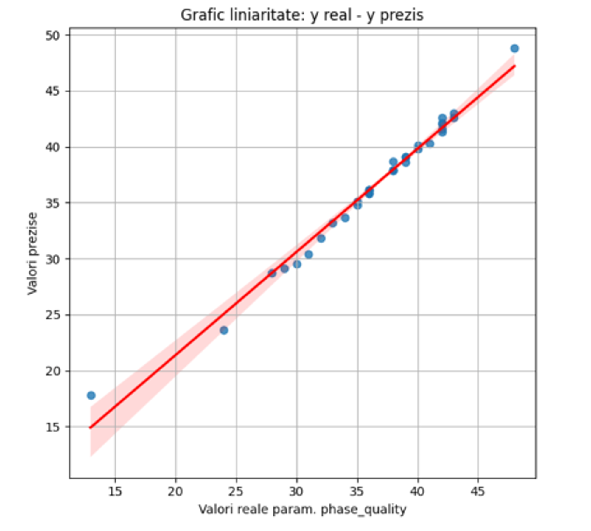</td>
    <td>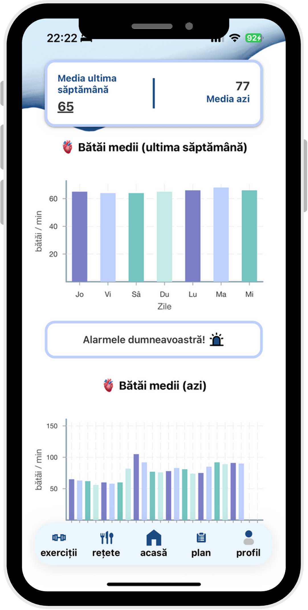</td>
  </tr>
</table>

 

<table>
  <tr>
    <td align="center"><b>Food Overview</b></td>
    <td align="center"><b>Daily Food Journal</b></td>
    <td align="center"><b>Nutrition Facts</b></td>
    <td align="center"><b>Recommended Recipes</b></td>
  </tr>
  <tr>
    <td>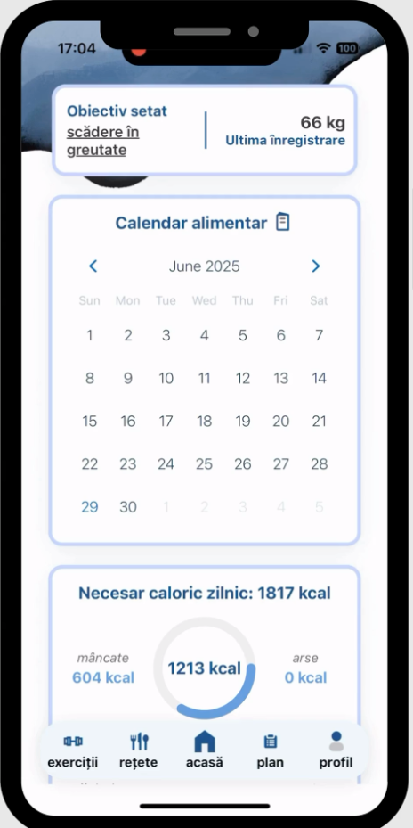</td>
    <td></td>
    <td>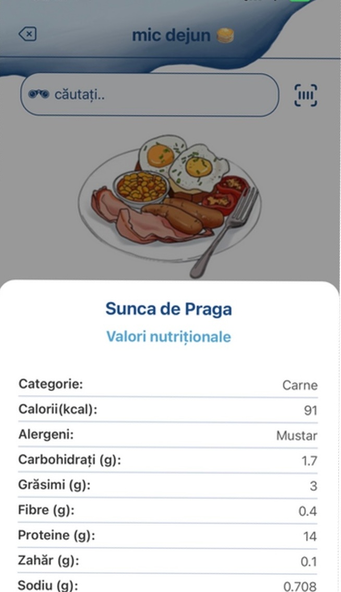</td>
    <td>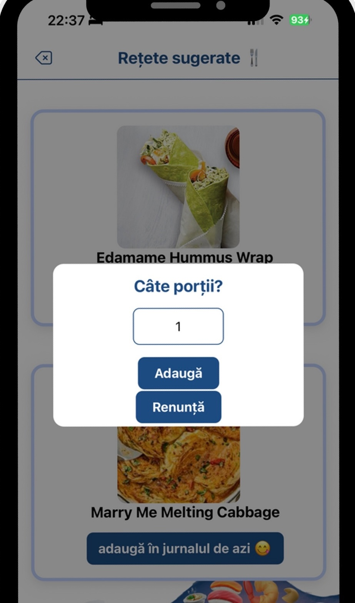</td>
  </tr>
</table>

 

<table>
  <tr>
    <td align="center"><b>Weight History</b></td>
    <td align="center"><b>YouTube Exercises</b></td>
    <td align="center"><b>Recommended Exercises</b></td>
  </tr>
  <tr>
    <td>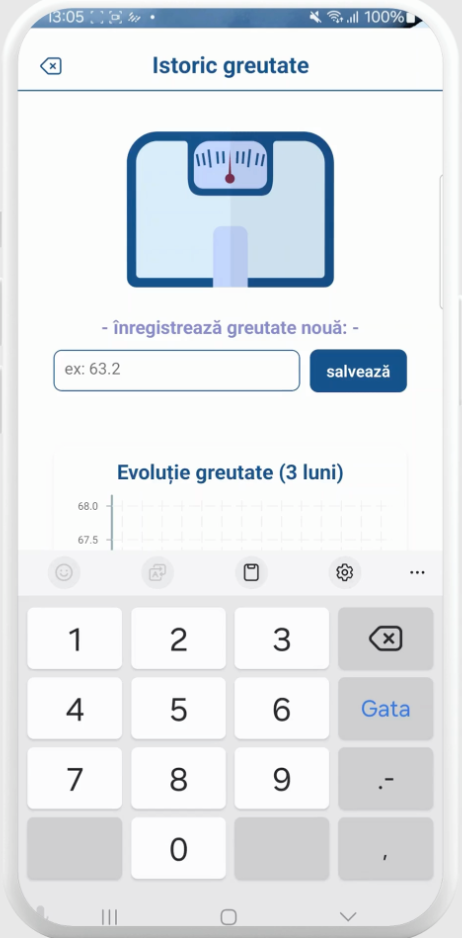</td>
    <td>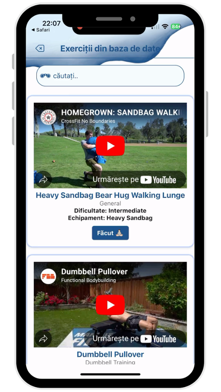</td>
    <td>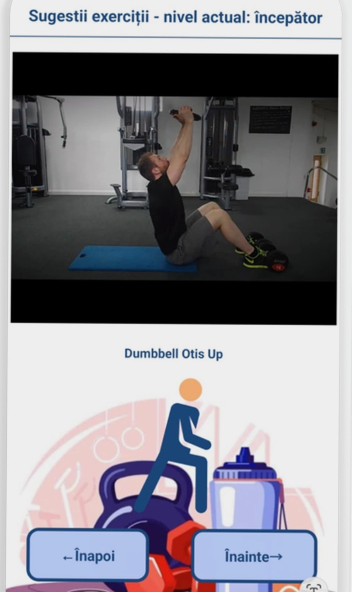</td>
  </tr>
</table>

# Health Monitor App
Developed as part of my Bachelor’s Thesis at the University Politehnica of Bucharest, Faculty of Electronics, Telecommunications and Information Technology, presented in June, 2025.

## App Overview
The app provides users with a unified interface to track key physiological parameters such as:
- Heart rate and cardiac alerts
- Sleep quality and sleep stage breakdown (light, REM, deep)
- Daily activity (steps, calories burned, exercises)
- Nutrition and hydration tracking
- Personalized meal and workout recommendations

## Key Features
- **Fitbit API integration** for retrieving real-time physiological data  
- **Firebase Authentication** for secure user login  
- **Cloud Firestore** for data storage and synchronization  
- **AsyncStorage** for local caching and offline support  
- **Flask API (Render)** hosting a TensorFlow Lite regression model that predicts the optimal sleep time  
- **Dynamic charts** for visualizing progress and historical data  
- **Smart recommendations** based on user goals and allergen profile

## Tech Stack
- **Frontend:** React Native (TypeScript)
- **Backend:** Firebase (Auth, Firestore, Storage)
- **ML Service:** Flask + TensorFlow Lite hosted on Render
- **API Integration:** Fitbit Web API (OAuth 2.0)
- **Data Format:** JSON / CSV

## Firebase Collections
| Collection | Purpose |
|-------------|----------|
| `user` | Stores user IDs, Fitbit tokens, and registration metadata |
| `chestionar` | Initial questionnaire data (age, height, weight, goals) |
| `activity_logs` | Physical activity data (steps, calories, exercises) |
| `sleep_logs` | Sleep data and model input fields |
| `nutrition_logs` | Daily food and water intake |
| `health_metrics` | Calculated metrics like BMI, BMR, HR avg/max |
| `retete_database` | Daily meal suggestions |
| `exercices` | Workout templates |

## Security
Firestore rules restrict read/write access based on the authenticated user’s `uid`. Sensitive Fitbit tokens are encrypted locally using AsyncStorage.

## Future Improvements
- Integration with Apple Health or Huawei Health
- Doctor dashboards for remote health interpretation
- Expanded ML models for anomaly detection
- UI/UX redesign in Flutter for higher performance

## Author
**Alexandra-Teodora Anton**  
Faculty of Electronics, Telecommunications and Information Technology  
University Politehnica of Bucharest (June, 2025)  

---

> _“Prevention is still the best medicine.” – OASH, 2024_

